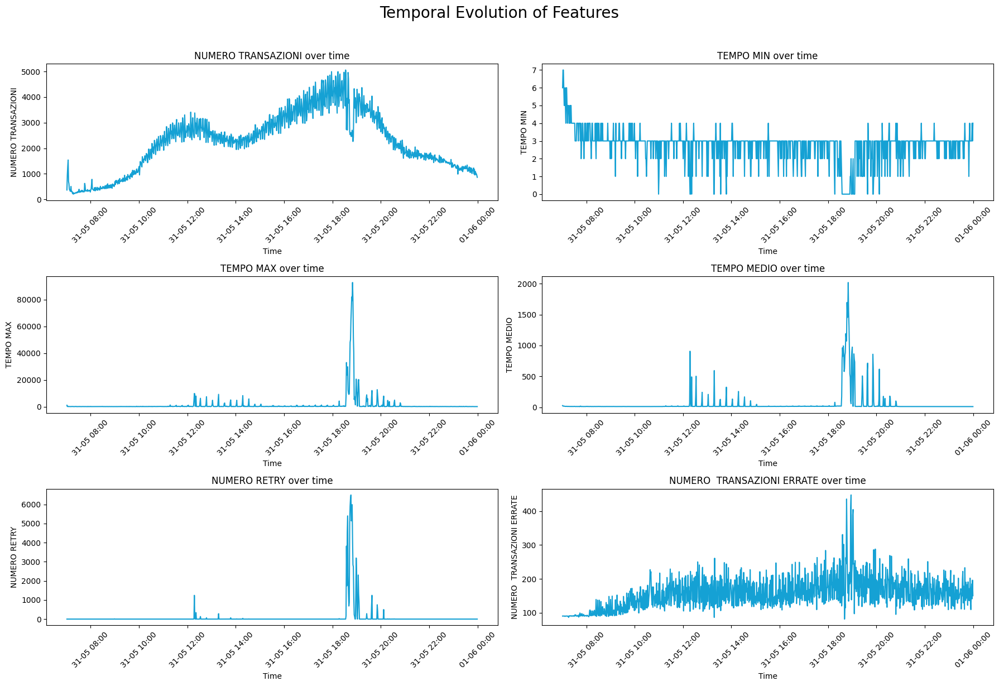

# Anomaly Detetction - REPLY 
**Team Members:** Anastasia Farinaro, Gaia D'Amico, Alessia Lorenzini

---

## Section 1 – Introduction

This project focuses on the development of an anomaly detection system applied to a time-series dataset. The dataset consists of daily records of system alarms, including attributes such as Code_ID, Timestamp, Number of Transactions, Time Min, Time Max, Number of Retries, and Number of Wrong Transactions. These features capture essential aspects of transactional system behavior over time.

The objective is to design and implement a pipeline that integrates forecasting models with anomaly detection techniques to identify unusual patterns or behaviors that deviate from expected trends.

The ultimate goal is to detect deviations in system behavior at an early stage, in order to prevent potential failures or ambiguous activity. Early identification of such anomalies is crucial for maintaining operational reliability, as well as for uncovering possible system malfunctions or fraudulent actions.

---

## Section 2 – Methods

We followed a sequential pipeline composed of four main phases: Exploratory Data Analysis (EDA), Data Augmentation, Forecasting, and Anomaly Detection.
For each step, we tested different approaches and selected the one that gave the best results. This allowed us not to settle for the first attempt, but to explore multiple options and make more informed choices along the way.

### 2.1 Exploratory Data Analysis (EDA) ###

We began with exploratory data analysis to uncover meaningful temporal behaviors before applying augmentation. We started by conducting exploratory data analysis (EDA) to understand daily transactional patterns and identify meaningful indicators. Key findings included:

- Total Transactions: Two peaks, reveal a strong daily pattern useful for forecasting.

- Failed Transactions: Highly variable with evening peaks, suggesting a correlation with traffic and potential anomalies.

- Retry Attempts: Sparse values with a critical spike between 18:00 and 19:30, indicating a possible system failure or overload.

Performing a Correlation Matrix we saw that retry attempts are strongly associated with long processing times, while failed transactions moderately correlate with volume, and TEMPO MIN is inversely related to most features.
Key correlations:
- TEMPO MAX <-> NUMERO RETRY (0.89)
- NUMERO TRANSAZIONI <-> TRANSAZIONI ERRATE (0.52)
- Negative: TEMPO MIN <-> others
  
These insights guided our next steps.

## 2.2 Data Augmentation ## 

Since we only had a single day of registered data, we needed to perform data augmentation. We augmented the dataset by generating synthetic sequences that respect the dataset structure, time order, and statistical relationships among features. What we focused on while testing different approaches was to preserve temporal consistency: respecting daily/hourly continuity, avoiding unrealistic time jumps, replicating recurring patterns, and maintaining inter-feature relationships.

We tested various techniques (LLM, SDV), ultimately selecting statistical noise injection to generate augmented sequences while preserving temporal logic. 

GAN-based synthetic generation (via SDV) was discarded due to its failure to learn and capture seasonality and  dynamics like peaks or retry spikes. Despite the successful generation of 2 full synthetic days using a GAN-based model (SDV – SingleTablePreset), the evaluation through time series plots reveals several limitations. LLM performed well, but data augmented with statistical noise proved slightly more robust and consistent, so we chose it for the next steps.

To validate each augmented dataset by these approaches, we conducted EDA comparing real and augmented distributions after every try. We evaluated the mean, standard deviation, min/max values, and quantiles of each key variable to ensure alignment with the original dataset. This step was crucial to confirm that the synthetic data enhanced model performance without compromising quality or introducing misleading patterns.

## 2.3 Forecasting Models ## 

The goal of this phase was to predict the short-term evolution of data to enable proactive monitoring and anomaly detection. Among all variables, we selected NUMERO TRANSAZIONI as the main target, as it reflects overall system activity and is temporally well-structured.
We selected LSTM, an RNN able to capture sequential dependencies and nonlinear behaviors, we employed a Long Short-Term Memory (LSTM) model. We selected LSTM because it learns from sequences and long-term dependencies, it's a robust model, and it's able to handle noisy and high-frequency transactional data.

We used a MinMaxScaler to normalize the inputs, split the dataset into an 80/20 train-test split (chronologically), and trained a simple LSTM architecture with 50 units and dropout.

The model successfully reproduced the main shape of the transactional series, tracking peaks and cycles with good alignment. Though minor fluctuations were smoothed, the predictions remained highly interpretable and stable. Overall we decided it was a good resulte despite its smoothing effect causing sharp spikes to be underestimated. 

## 2.4 Anomaly Detection Methods ## 

To detect anomalies from the LSTM-based forecast, we applied and compared three distinct unsupervised approaches:

1. Delta-Based Detection

This method computes the difference between consecutive LSTM predictions and flags any sudden change that exceeds a statistical threshold (mean ± 2*std). It effectively captures abrupt transitions such as spikes or drops immediately after peaks. Its main limitation it's that it may react to local noise.

2. Isolation Forest

This algorithm isolates anomalies by partitioning the data. Points that require fewer splits to isolate are considered anomalous.

3. Local Outlier Factor (LOF)

LOF compares the local density of each point to that of its neighbors, identifying points that reside in sparse regions. It captured anomalies around both smooth transitions and sudden peaks. While it adapts well to local structure, it is sensitive to the n_neighbors parameter and may flag false positives in non-linear zones.

## Section 3 –  Experimental Design ## 

## 3.1 Forecasting ## 

To achieve this, we trained and evaluated two models: Long Short-Term Memory (LSTM) and XGBoost. LSTM has been already discussed in the previous section, as it was our finally chosen model.

XGBoost, a tree-based algorithm for structured data, was used as a baseline. Despite its ability to model lag features and perform well on tabular data, it lacks the temporal awareness intrinsic to sequential models. This limitation became evident in our results: while XGBoost captured some local fluctuations, it frequently overfitted noise and failed to model the broader transaction cycle, leading to jagged and erratic forecasts.

On the other hand, LSTM, which is specifically designed for time series tasks, delivered smooth and coherent forecasts. It was able to capture both short-term dependencies and long-range seasonality, making it a more robust and stable forecasting engine. Visual inspection showed that LSTM predictions followed the actual trend closely, especially around peak hours, whereas XGBoost often exaggerated fluctuations.

To quantify performance, we used three metrics:

MAE (Mean Absolute Error)

RMSE (Root Mean Squared Error)

R² (Coefficient of Determination)

XGboost performance metrics were: MAE = 401.75, RMSE = 519.08, R² = 0.677.
LSTM model achieved these metrics: MAE = 239.45, RMSE = 327.28, and R² = 0.872.

These metrics confirmed the superiority of LSTM in modeling the temporal behavior of transactional data. Thus, we selected LSTM as the core forecasting model for the anomaly detection pipeline.

## Section 4 - Results ##

The main findings of our pipeline show that combining LSTM forecasting with unsupervised anomaly detection methods can effectively identify both sudden spikes and subtle irregularities in transactional system behavior. Among the anomaly detection techniques tested, the Local Outlier Factor (LOF) delivered the most nuanced detection, capturing deviations that aligned well with known high-traffic periods and previously observed retry spikes. Delta-based detection was effective in identifying sharp transitions, while Isolation Forest offered a broader but less precise anomaly mapping.

The best forecasting results were achieved using the LSTM model, which significantly outperformed the XGBoost baseline in terms of MAE, RMSE, and R². This confirms that temporal awareness and sequence modeling are essential when dealing with transactional time series data.

## Section 5 - Conclusions ##

This project demonstrated that the integration of LSTM forecasting with unsupervised anomaly detection techniques provides a powerful tool for identifying deviations in system behavior. Through careful data augmentation, we overcame the limitations of a single-day dataset, allowing our models to generalize over a realistic sequence of events. Our findings emphasize the importance of combining temporal modeling with robust detection methods to capture both expected trends and critical anomalies. LSTM emerged as the most reliable forecasting model due to its ability to handle temporal dependencies and high-frequency noise.

However, some questions remain open. While our synthetic data preserved core statistical properties, its ability to reproduce real-world anomalies is inherently limited. Moreover, threshold-based methods like delta detection can be overly sensitive to noise, and density-based methods such as LOF depend heavily on parameter tuning. Future work could explore hybrid detection strategies, introduce attention-based architectures like Transformers for richer sequence modeling, and validate the pipeline on longer and more diverse time series to enhance robustness and scalability.

